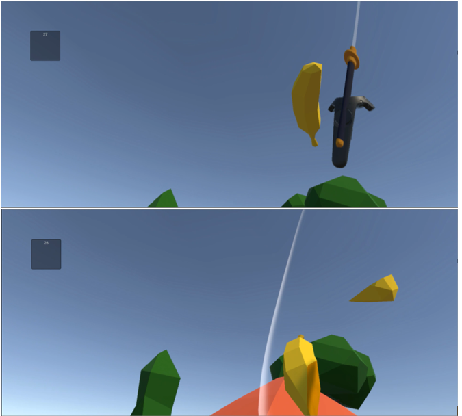

# Unity_VR_MSc_project
An interactive motion game using motion capture technology and virtual reality

The application contains 3 scenes, each focused on different motoric function. Motion tracking is implemented, allowing for analysis of the movement after the game.

Scene 1:
Fruit Ninja inspired game.

Scene 2:
Beat Saber inspired game, however including additional controllers - trackers placed at players’ ankles, providing additional complexity to the game.

Scene 3:
The purpose of the game is to hold a plane with a ball on top of it and avoid incoming cars. 

Thanks to movement tracking, paths can be plotted after the game.

